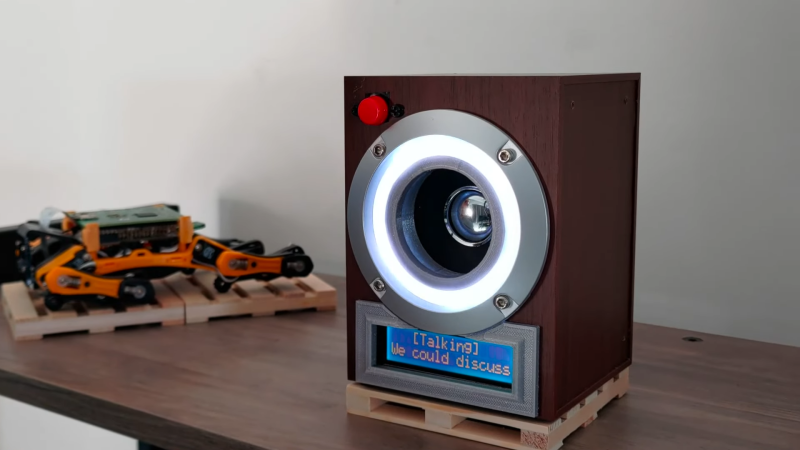
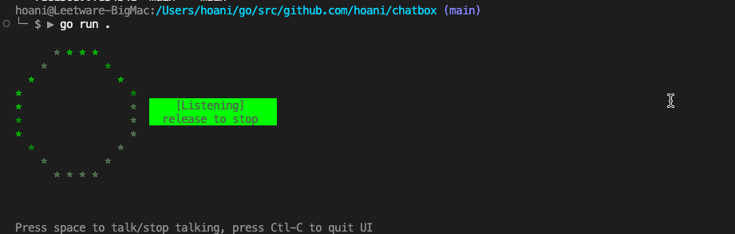
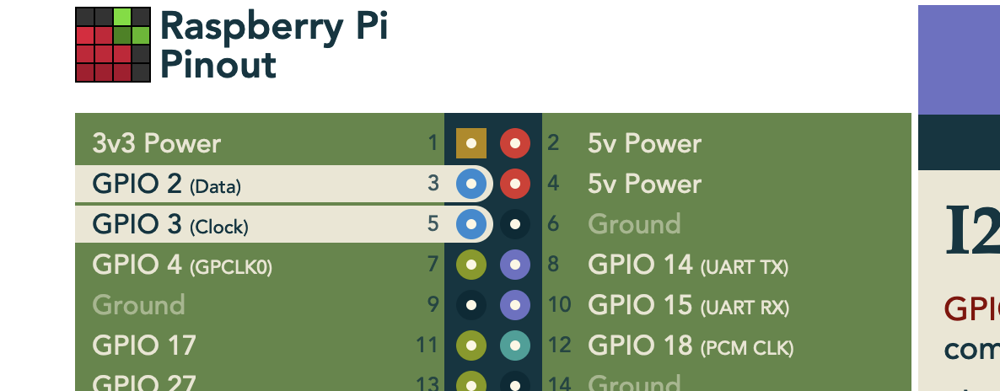
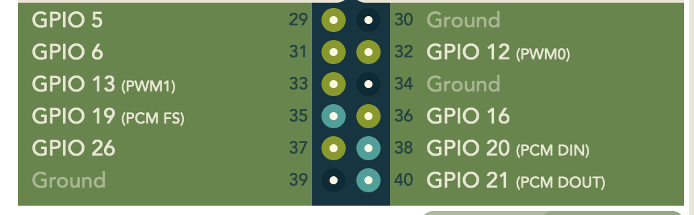

A chatbot companion project.



Combines openai's chat and voice apis with hardware to make an AI you can talk to.

## Running

This project was developped on Macbook and a Raspberry Pi.

Before running this make sure you set your `OPENAI_KEY` environment variable:

```
export OPENAI_KEY=<my-openai-key>
```

### Macbook Development

On a Macbook, there is a TUI (terminal UI) which simulates some of the hardware such as LEDs, LCD and Pushbutton. It will use your computers microphone and speaker hardware, just like the raspberry pi does.




### Raspberry Pi Development

To develop on a raspberry pi, I suggest running this with:

```
go run . 2> /dev/null
```

Otherwise you may see a lot of ALSA logs complaining about the hardware... I tried to remove these in a sensible way, but it appears to be a known issue with portaudio and ALSA's libraries.

### Raspberry Pi Deployment

To deploy this on your Raspberry Pi, run:

```
go build .
./service/addService.sh
systemctl --user start chatbox
```

To make it run on boot:
```
systemctl --user enable chatbox
```

To check logs:
```
journalctl --user -u chatbox --since "10 minutes ago"
```

The hardware I run this on is a Rasberry Pi 4B 2GB... hopefully there are no memory leaks.

Running this on a Raspberry Pi with Desktop is fine, but I suggest switching to terminal mode once you have put your Pi in your enclosure.

## Hardware Setup

This project expects that the raspberry pi is connected to an arduino running serial pixel: https://github.com/hoani/serial-pixel

Make sure you enable I2C in the raspberry pi - this is needed for the LCD.

### Raspberry Pi Dependencies

```
apt install mpg123 portaudio19-dev espeak
```

### Raspberry Pi Connections

The LCD used for this project is [LCD1602](https://www.waveshare.com/wiki/LCD1602_RGB_Module).

This is connected to the i2c pins 3 and 5, as well as GND and 3V3.



A push button is used for signalling when it is time to talk to the chatbox. This is connected to GPIO 5 and GND:



In my build, I:
* connected my serial-pixel arduino into a USB port
* used a USB speaker which connected to the Pi with an audio jack
* used a USB webcam as my microphone

## Custom commands

I got sick of rebooting my raspberry pi. So I have added a couple of control commands that you can speak to the chatbox:

* `"shutdown"` will shutdown the raspberry pi... very helpful in avoiding corrupting your disk drives.
* `"change personality to <Someone>"` will change the personality of the chatbox and reset your chat history

# Hardware

## Bill of materials

This list isn't exhaustive, a lot of the decisions I made were based around what is available to buy locally in New Zealand.

* Raspberry Pi 4B/3B+
    * any RAM is fine, this project uses only ~200Mb max 
    * Raspberry Pi 3B+
* Teensy 4.0
    * Pretty much any other arduino that fits in the box also works
* Genius SP-HF280 USB Speakers
* Duinotech 24 LED 72mm circular board
* [Sunfounder USB Microphone](https://www.sunfounder.com/products/mini-usb-microphone)
* [Waveshare RGB 1602 LCD](https://www.waveshare.com/lcd1602-rgb-module.htm)
* Push button

There were also a bunch of 3D printed parts and so on. A video showing the build is on youtube:
[](https://www.youtube.com/watch?v=rzS5zLpd1os)
